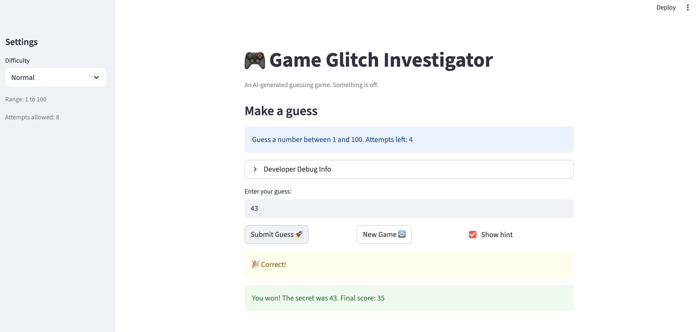
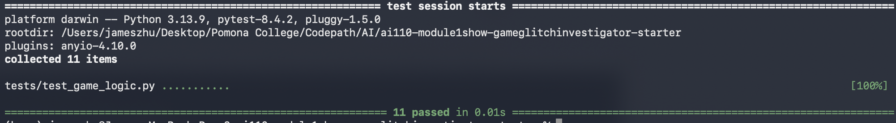

# 🎮 Game Glitch Investigator: The Impossible Guesser

## 🚨 The Situation

You asked an AI to build a simple "Number Guessing Game" using Streamlit.
It wrote the code, ran away, and now the game is unplayable. 

- You can't win.
- The hints lie to you.
- The secret number seems to have commitment issues.

## 🛠️ Setup

1. Install dependencies: `pip install -r requirements.txt`
2. Run the broken app: `python -m streamlit run app.py`

## 🕵️‍♂️ Your Mission

1. **Play the game.** Open the "Developer Debug Info" tab in the app to see the secret number. Try to win.
2. **Find the State Bug.** Why does the secret number change every time you click "Submit"? Ask ChatGPT: *"How do I keep a variable from resetting in Streamlit when I click a button?"*
3. **Fix the Logic.** The hints ("Higher/Lower") are wrong. Fix them.
4. **Refactor & Test.** - Move the logic into `logic_utils.py`.
   - Run `pytest` in your terminal.
   - Keep fixing until all tests pass!

## 📝 Document Your Experience

**Game purpose:** A number-guessing game where the player picks a difficulty, gets a limited number of attempts, and uses Higher/Lower hints to narrow in on a secret number. Points are awarded based on how quickly you find the correct answer.

**Bugs found:**
1. **Swapped hints** — `check_guess` returned "Go HIGHER!" when the guess was too high and "Go LOWER!" when too low. The messages were completely backwards.
2. **String-comparison bug** — On every even-numbered attempt, the secret number was cast to a string before comparison. This caused lexicographic ordering (`"9" > "42"` = True) instead of numeric ordering, producing random-looking wrong hints.
3. **Broken New Game reset** — The "New Game" button only reset `attempts` (to 0, not 1) and regenerated the secret using a hardcoded range of 1–100, ignoring the selected difficulty. Score, status, and history were left over from the previous game.

**Fixes applied:**
- Refactored all game logic (`get_range_for_difficulty`, `parse_guess`, `check_guess`, `update_score`) out of `app.py` and into `logic_utils.py`.
- Fixed `check_guess` so `guess > secret` correctly returns "Too High / Go LOWER!" and vice versa.
- Removed the even/odd string-cast block; the integer secret is now always passed directly to `check_guess`.
- Fixed the "New Game" handler to fully reset all session state (`secret`, `attempts`, `score`, `status`, `history`) using the current difficulty range.

## 📸 Demo

## 🧪 Pytest Results

## 🚀 Stretch Features

### Challenge 2: Guess History Sidebar

A **Guess History** panel was added to the sidebar. After each guess it shows:
- The guess number and value
- The outcome (Too High / Too Low / Win)
- A hot/cold bar (🔥/🧊) scaled to how close the guess was to the secret

**How Claude Code Agent orchestrated the multi-file changes:**
The agent was prompted: *"Add a sidebar section that shows each guess, its outcome, and how far it was from the secret as a visual distance bar. Store history as dicts so we can display structured data without touching the core game logic functions."*
It identified that two areas of `app.py` needed to change together: (1) the submit handler had to store `{"guess", "outcome", "distance"}` dicts instead of bare integers, and (2) the sidebar rendering block had to read and display those dicts. Because all logic lives in `logic_utils.py` and was untouched, the feature was added cleanly without regressions.

- [ ] [Insert a screenshot of the Guess History sidebar here]
